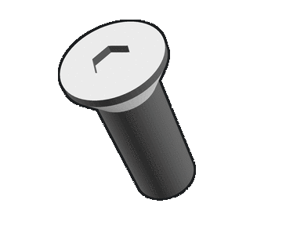

# rackstack

### A parametric 3d-printable mini rack system
- ***Mount Anything:*** Perfect for organizing SBCs, mini PCs, small switches, power hubs, etc.
- ***Fully customizable:*** Fully written in OpenSCAD. Everything, from the dimensions of the rack, to the roundness of the corners, can be modified with a simple code change.
- ***Printable from home:*** Designed to be printed with conventional FDM printers. Requires minimal supports when printing, and final assembly needs only a few easy-to-source parts. 
- ***No cage nuts!*** Sliding hex nut design for the front rails allows one to easily mount items without dealing with cage nuts.
- ***Stackable:*** Individual racks can be easily stacked and fastened together. Mix and match different color and design combinations!

### Renders
See the [renders for difference parametric profiles here](media/renders)

## Assembly

Pre-generated STLs for roughly 200mm^3, and 100mm^3 rack frames can be found in [stl/rack](stl/rack).
These STLs are generated from the files in [rack/print](rack/print), and [rack-mount/print](rack-mount/print) - further information about printing these parts 
(supports, orientation) can be found in their respective `.scad` files.

### Assembly Instructions
Please see [the assembly README here](./assembly)

### Required Tools:
- 3d FDM Printer - build size requirements depend on configure rack size. (TODO explain)
- M3 Allen Key
- M4 Allen Key

### BOM - Single Rack:

| Item                                          | Name                      | Quantity | Comment                   |
|-----------------------------------------------|---------------------------|----------|---------------------------|
|    | M3x8 FHCS                 | 16       | Get double!               |
|   | M3x10 FHCS                | 4        | ☝️                        |
|   | M3x12 FHCS                | 16       | ☝️                        |
|  | M3 hex nut                | 36       | ☝️                        |
|   | 3x10 steel dowel pin      | 4        | 3mm diameter, 10mm height |
|  | 6x2 neodymium disc magnet | 8        | 6mm diameter, 2mm height  |
 
#### Notes: 

- Omitted actual plastic for printing. Any conventional 3d printing plastic should do (PLA, PETG, ABS),
but beware of PLA's thermal limits. Higher infill is recommended for all parts.
- For joining two racks, you will need 8 M3 hex nuts, and 8 M3x10 FHCS (TODO confirm)
- Main front rails are mounted using M4 hex nuts and screws.
- Side rails are mounted using M3 screws

## Configuring + Generating STLs

WIP

Requirements:
  - `openscad` cli command (Only runs on Linux)
  - `python3`

`python3 rbuild.py --help`
