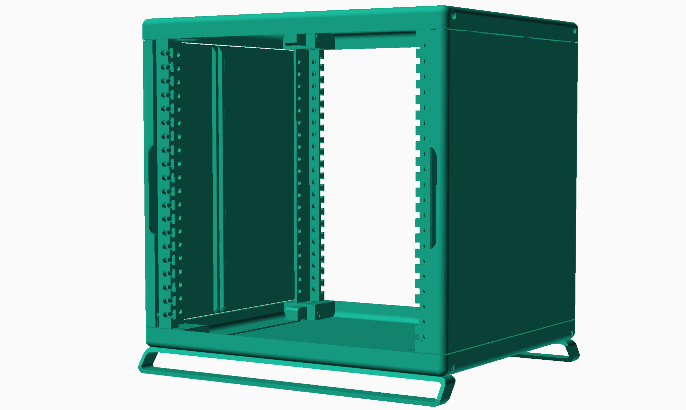

# rackstack

---

A parametric 3d-printable (mini) rack system.

- ***Not just STLs:*** Fully written in OpenSCAD. Everything, from the dimensions of the rack, to the roundness of the corners, can be modified with a simple code change.
- ***Printable from home:*** Designed to be printed with conventional FDM printers. Requires minimal supports when printing, and final assembly needs only a few easy-to-source parts. 
- ***No cage nuts!*** 
- ***Stackable:*** Individual racks can be easily stacked together. Mix and match different color and design combinations!

### Renders
See the [renders for difference parametric profiles here](media/renders)

---

## Features

Sliding nut design for the front rails allows one to easily mount items without dealing with cage nuts.

 

Individual racks can be stacked and fastened together. 
 

There's also cool magnetic side doors.

---

## Assembly

### BOM

---

## Configuring + Generating STLs

