# Rack Assembly Instructions

**Note**: Please see
- [BOM](../README.md#bom---single-rack) for required materials, beyond the actual 3D printed parts.
- [Print BOM](../README.md#printing---single-rack) for all the required 3D printed parts for a single rack.

## Instructions:
Slide in M3 hex nuts into the Y-bars - 4 times. Each corner should have 3 hex nuts:
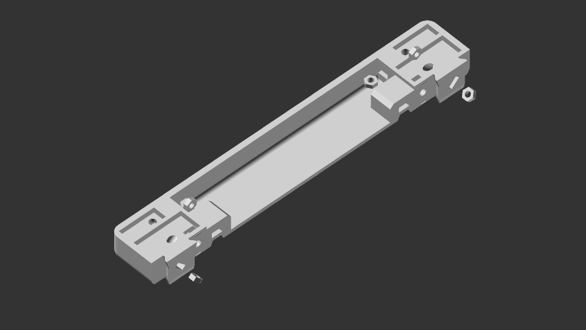

Glue magnets into magnet side-modules on the Y-bars - 4 times:
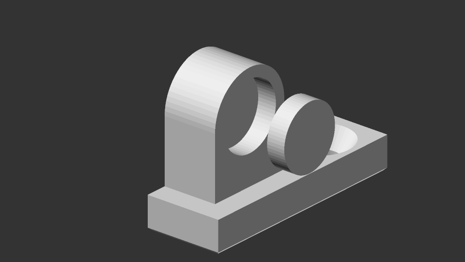

Glue top and bottom magnets into side walls - 2 times:
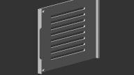

Insert top and bottom dowel rods into side walls - 2 times:
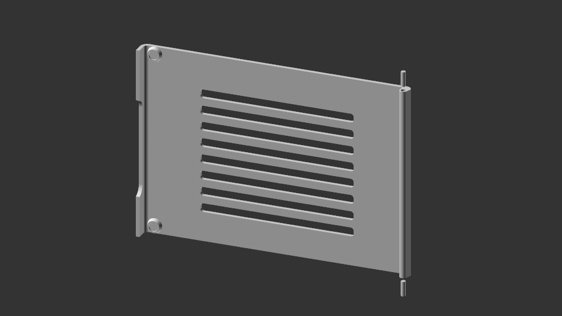

Slide Y-bars into X-bars. Do this 2 times. You should end up with 2 trays. Orientation on the Y-bars matters here; make sure that the magnets are on the same side:
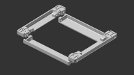

Screw together Y-bars and X-bars using 4 M3x16 FHCS screws (one screw per corner) - 2 times: 
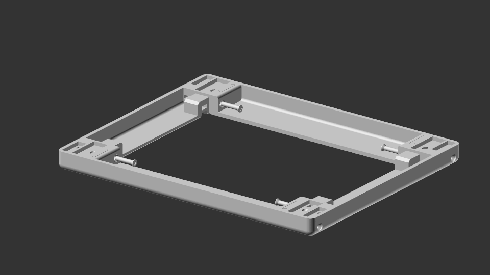

<!-- This step is only needed if the fixedSideModules is set to false. -->
<!-- Screw in the side-modules with M3x8 FHCS screws. Orientation matters here. The magnets modules should be on the eventual front side, facing outwards, and the two hinge modules should be in the back. Do this 2 times (for both trays): -->
<!-- 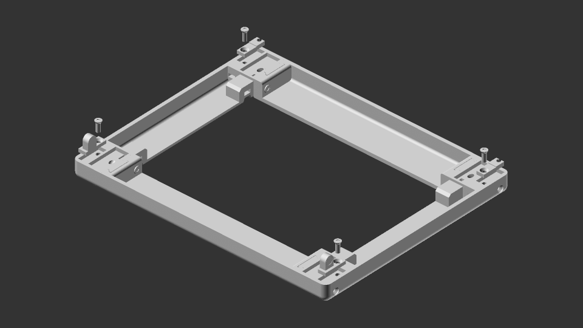 -->

Screw in the main rails with M3x16 FHCS screws.
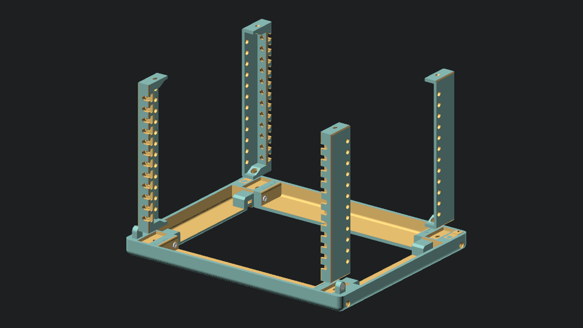

Prop us the side wall using the side modules. Make sure the dowels are inserted properly, and the magnets align:
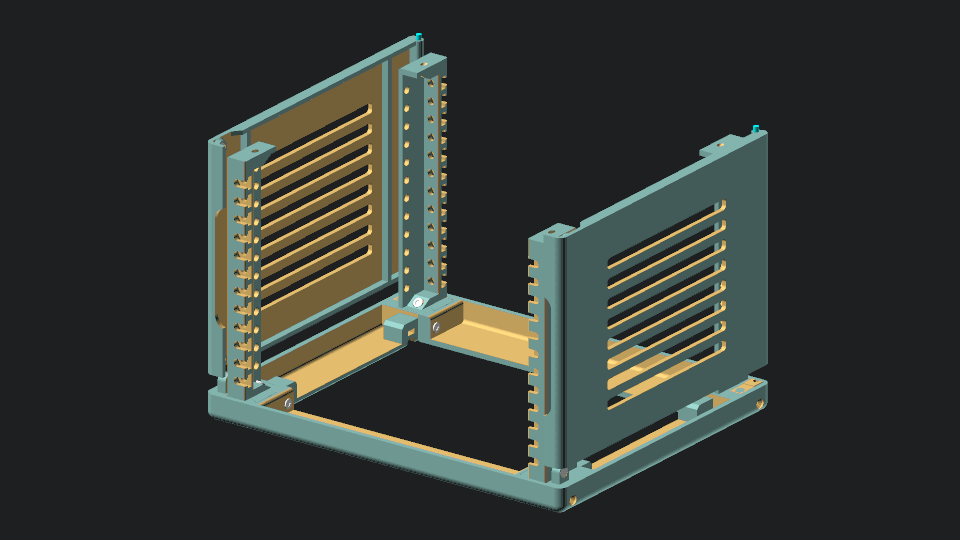

Slide in the other (top) tray. Make sure the magnets and dowels align. Screw in the main rails with M3x16 FHCS screws:
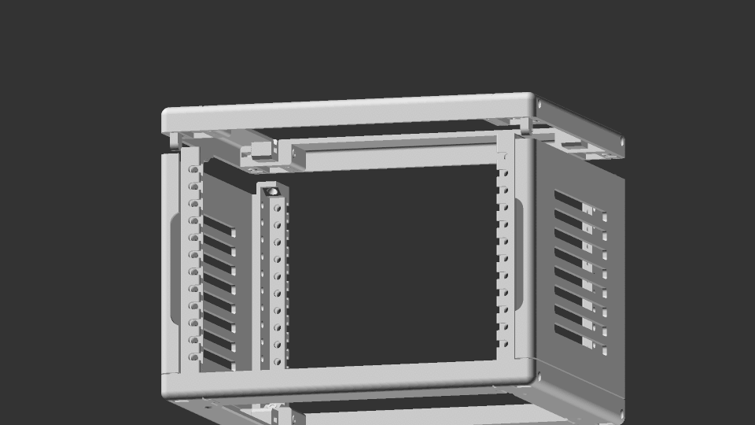

Attach the top and bottom plates with 4 M3x12 screws each:
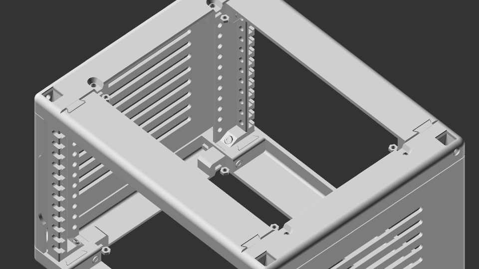
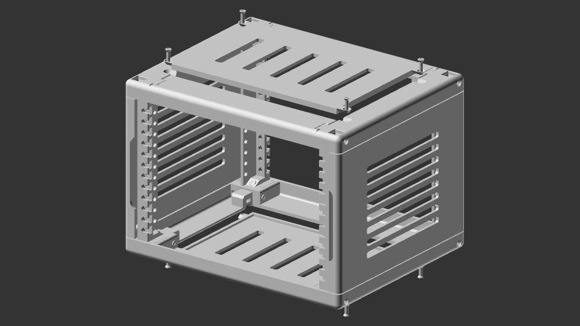

Slide in hex nuts into feet - 2 times:
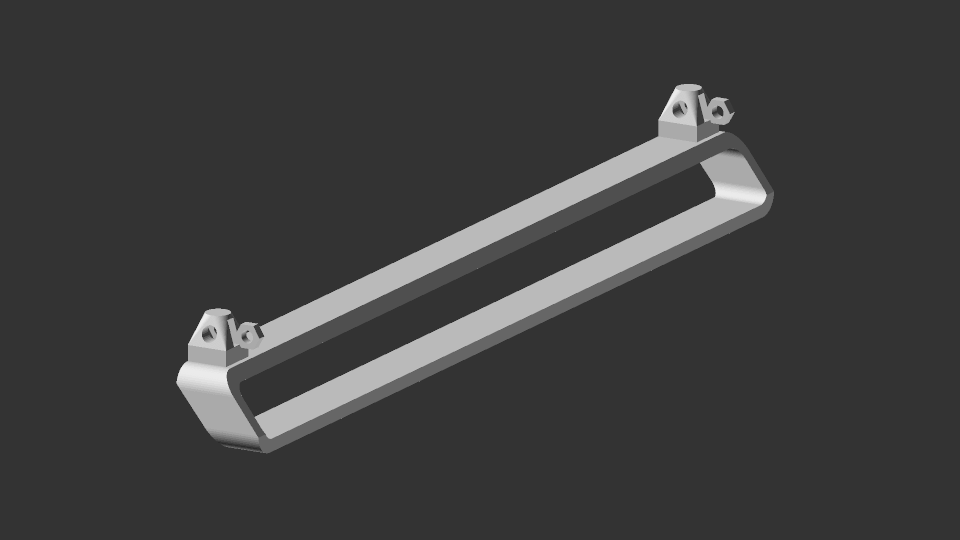

Insert feet into the bottom of the rack: 
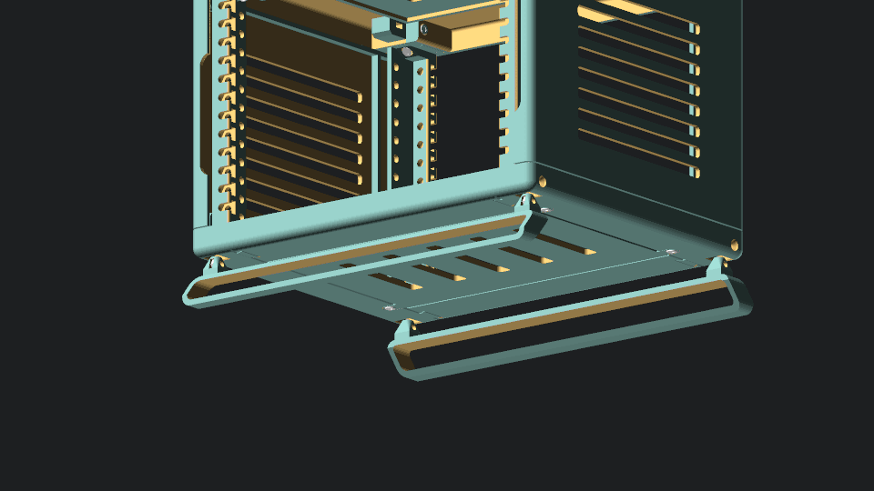

Screw in feet using 4 M3x12 FHCS screws:
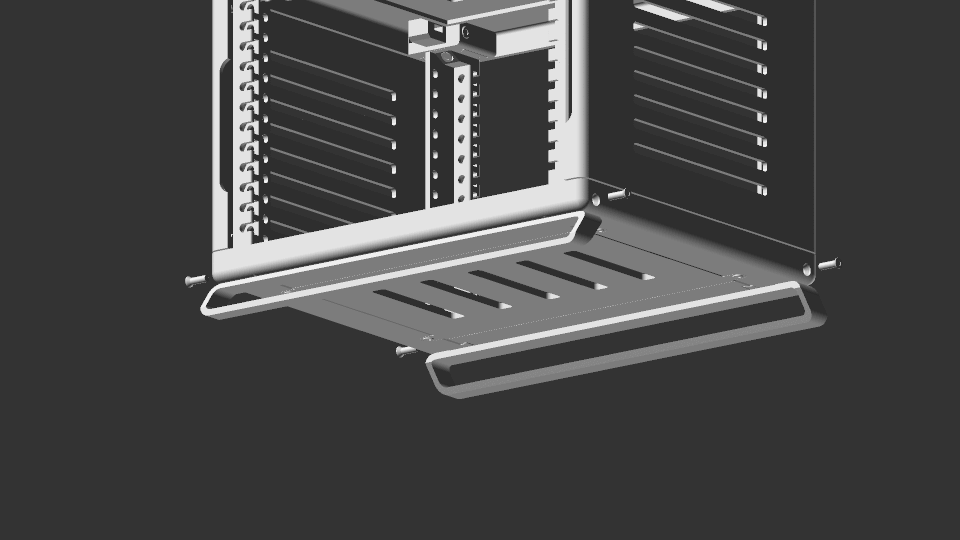

**FIN**
