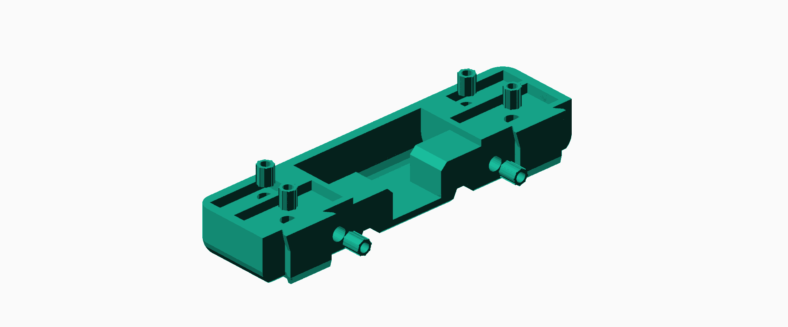
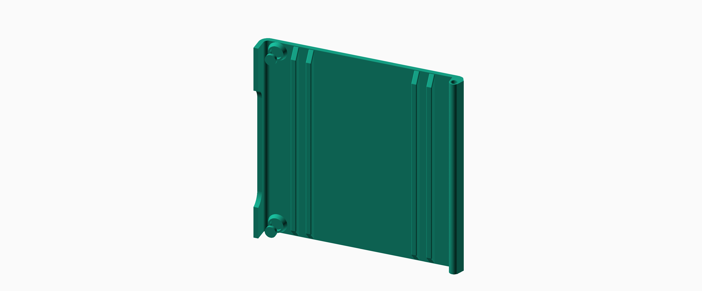
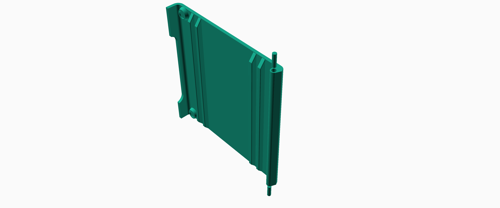
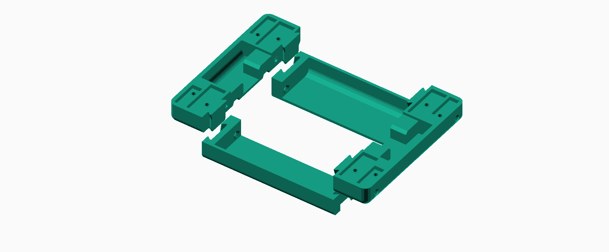
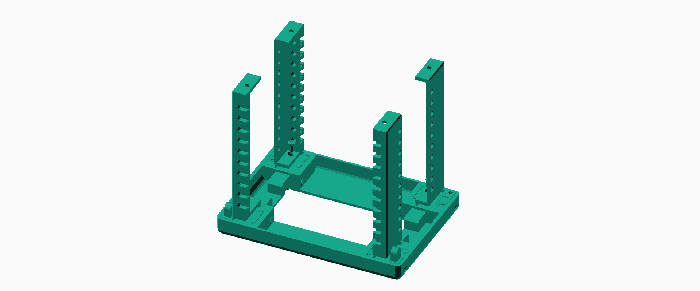
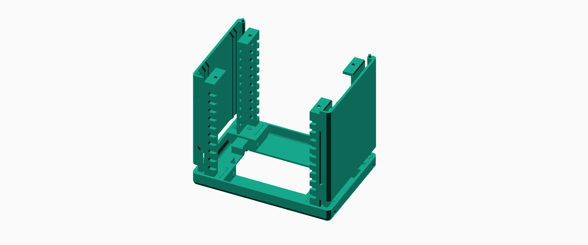
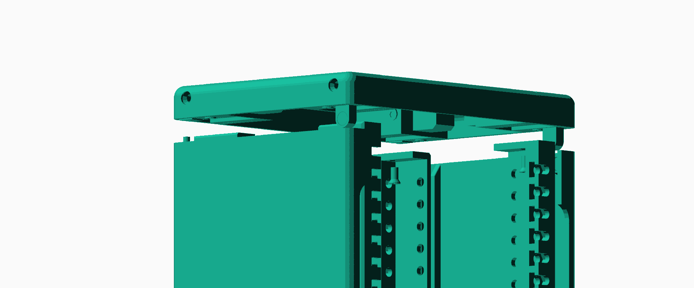
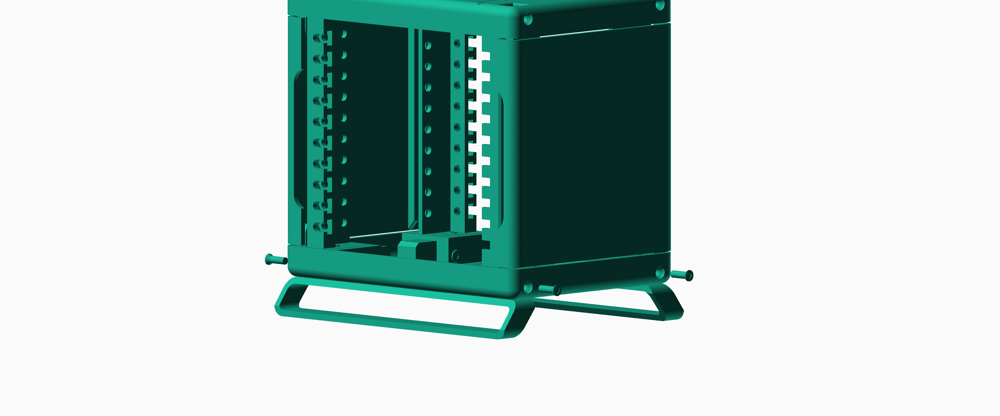

# Rack Assembly Instructions

**Note**: This rack uses two different types of M3 flat heat screws: a 6mm length screw, referred to as type A; and a 10mm length screw, referred as type B.

TODO: Add image reference for parts

## Instructions:
Insert heatset inserts into Y-bars - 4 times:

Glue magnets into magnet side-modules - 4 times:

Glue top and bottom magnets into side walls - 2 times:

Insert top and bottom dowel rods into side walls - 2 times:

Slide Y-bars into X-bars - 2 times:

Screw together Y-bars and X-bars using 4 B-type screws (one screw per corner) - 2 times: 

Screw in the side-modules with A-type screws: two magnet side modules in front with the magnets facing outwards, and two dowel holder side modules in the back - 2 times:

Screw in the main rails with A-type screws:

Prop us the side wall using the side modules. Make sure the dowels are inserted properly, and the magnets align:

Slide in the other (top) tray. Make sure the magnets and dowels align. Screw in the main rails with A-type screws:

Slide in hex nuts into feet - 2 times:

Insert feet into the bottom of the rack: 

Screw in feet using 4 B-type screws:

Finally, attach the top and bottom plates with 4 A-type screws each:

