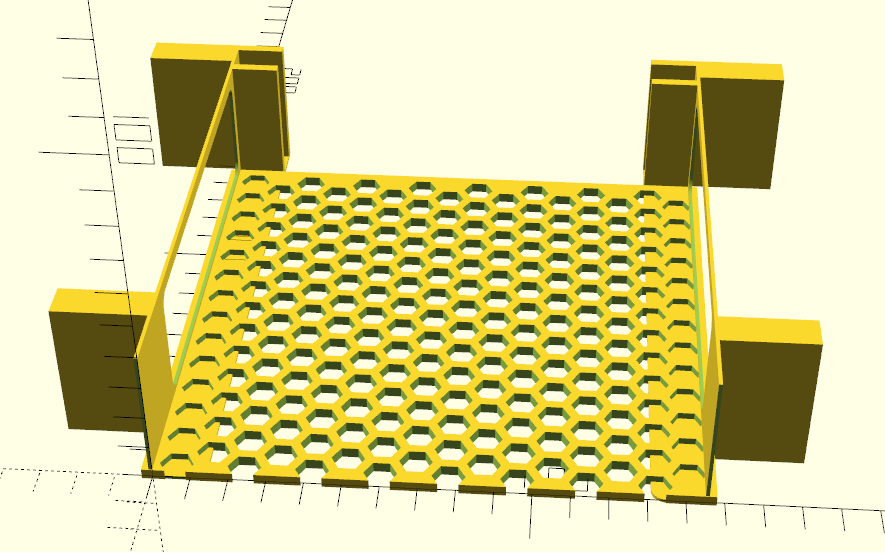

# Angle Bracket System

Please see [entry.scad](./entry.scad) for config and building. Make sure the correct rack profile is configured in [rackFrame.scad](../../../config/rackFrame.scad).

This uses the [angle brackets](./entry.scad) for the sides, but creates a full honeycomb tray spanning boxWidth and boxDepth for more stability, ventilation and less print material.

### BOM:

| Item                                                          | Name                      | Quantity | Comment                                                                                                                          |
|---------------------------------------------------------------|---------------------------|----------|----------------------------------------------------------------------------------------------------------------------------------|
|  | M3x12 FHCS                | 8        | Extras are useful and inexpensive. If you plan on eventually stacking multiple racks together, don't hesitate to get a lot more. |
|      | M3 hex nut                | 8        | ☝️                                                                                                                               |
