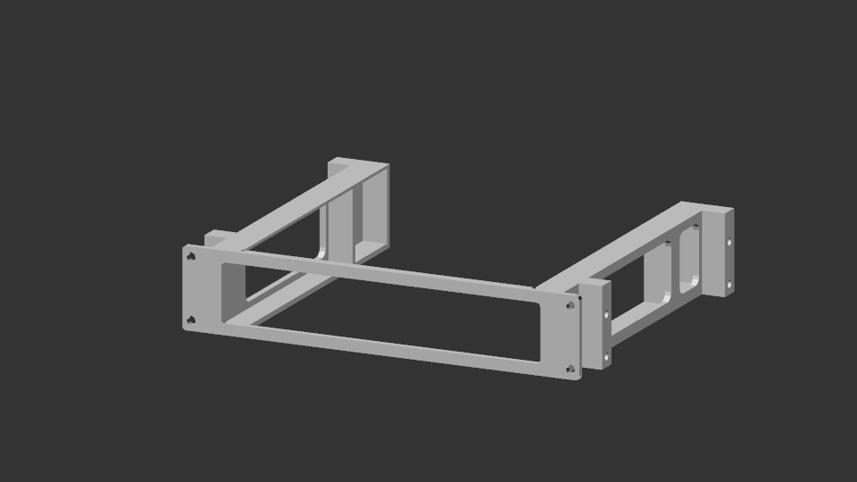

# Enclosed Box Mounting System

Please see [entry.scad](./entry.scad) for config and building. Make sure the correct rack profile is configured in [rackFrame.scad](../../config/rackFrame.scad).

- This system comprises three parts: two side rails, and a front plate.
- This system is useful for mounting heavier box-shaped things. It works by first sliding in the box inside the side rails (which secures `x`, `z`, and one half of the `y` axis), and then mounting the front plate along the main rails (fully securing the `y` axis).
- Side rails will most likely require supports to print.
- For wider boxes (nearing the `maxUnitWidth` of the rack), you will have to set `recessSideRail` to true. This is so the side rails do not collide with the main rack rails. 
