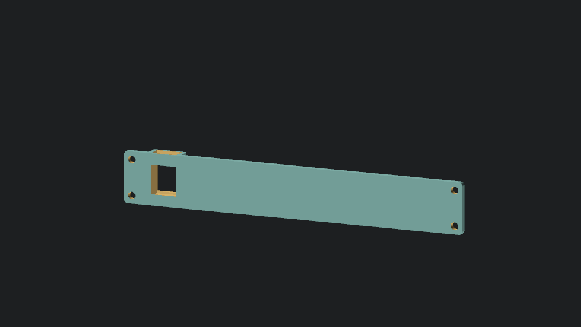

# Patch Panel

Please see [entry.scad](./entry.scad) for config and building. Make sure the correct rack profile is configured in [rackFrame.scad](../../config/rackFrame.scad).

- Mount RJ-45 keystone jacks with this part.
- Single part. Can be printed without supports.