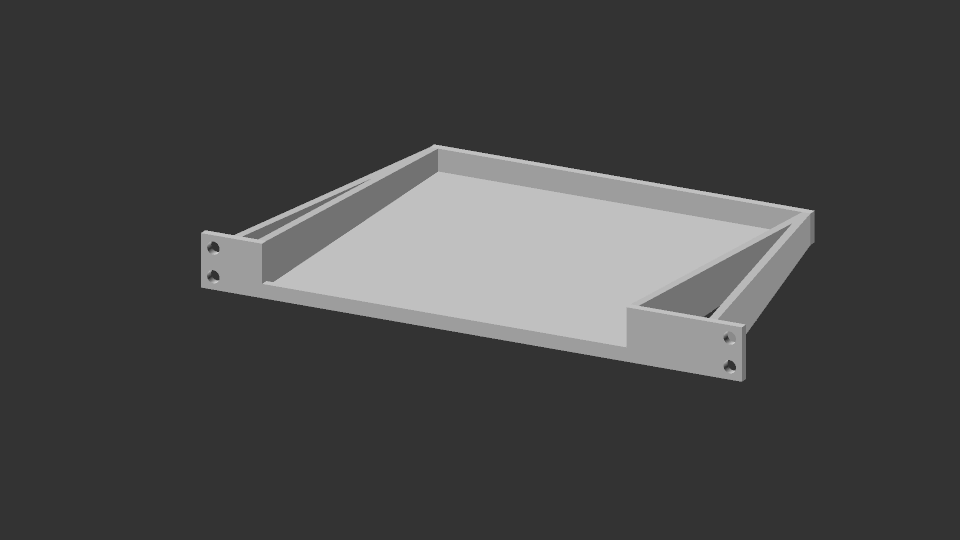

# Tray Mounting System

Please see [entry.scad](./entry.scad) for config and building. Make sure the correct rack profile is configured in [rackFrame.scad](../../config/rackFrame.scad).

- Mount on front rails. 
- Single part. Can be printed without supports.
- Includes support for custom bottom screws (see `mountPoints` in config). This is useful for SBCs and mini PCs with bottom screws.